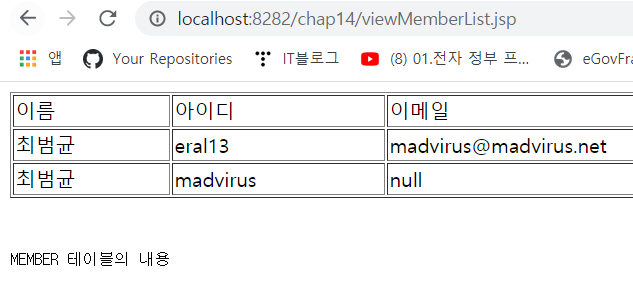

## JDBC 프로그래밍 코딩 순서
1. JDBC 드라이버 로딩
2. 데이터베이스 커넥션 구함
3. 쿼리 실행을 위한 Statement 객체 생성
4. 쿼리 실행
5. 쿼리 실행 결과 사용
6. Statement 종료
7. 데이터베이스 커넥션 종료

Mysql 5.7.16을 사용한다.

```jsp
<!-- /chap14/WebContent/viewMemberList.jsp -->
<%@ page contentType = "text/html; charset=utf-8" %>
<%@ page import = "java.sql.DriverManager" %>
<%@ page import = "java.sql.Connection" %>
<%@ page import = "java.sql.Statement" %>
<%@ page import = "java.sql.ResultSet" %>
<%@ page import = "java.sql.SQLException" %>

<html>
<head><title>회원 목록</title></head>
<body>

MEMBER 테이블의 내용
<table width="100%" border="1">
<tr>
	<td>이름</td><td>아이디</td><td>이메일</td>
</tr>
<%
	// 1. JDBC 드라이버 로딩
	Class.forName("com.mysql.jdbc.Driver");

	//java.sql.Connection 타입이 데이터베이스 커넥션을 의미한다.
	Connection conn = null;
	Statement stmt = null;
	ResultSet rs = null;
	
	try {
		//DBMS안에 데이터베이스를 식별하기 위한 JDBC URL
		//chap14라는 데이터베이스에 접속하는 것을 알 수 있다.
		//Mysql JDBC 드라이버가 Mysql 서버와 데이터를 주고받을 때 사용되는 
		//캐릭터 셋을 올바르게 지정하지 않으면 한글이나 한자와 같은 글자가 
		//잘못된 값으로 데이터베이스에 저장될 수 있다. 따라서 다음과 같이 추가 
		//파라미터를 이용해서 캐릭터 셋을 알맞게 지정해주어야 한다.
		String jdbcDriver = "jdbc:mysql://localhost:3306/chap14?" +
							"useUnicode=true&characterEncoding=utf8";
		String dbUser = "jspexam";
		String dbPass = "jsppw";
		
		String query = "select * from MEMBER order by MEMBERID";
		
		// 2. 데이터베이스 커넥션 생성
		conn = DriverManager.getConnection(jdbcDriver, dbUser, dbPass);
		
		// 3. Statement 생성
		stmt = conn.createStatement();
		
		// 4. 쿼리 실행
		rs = stmt.executeQuery(query);
		
		// 5. 쿼리 실행 결과 출력
		while(rs.next()) {
%>
<tr>
	<td><%= rs.getString("NAME") %></td>
	<td><%= rs.getString("MEMBERID") %></td>
	<td><%= rs.getString("EMAIL") %></td>
</tr>
<%
		}
	//DriverManager.getConnection() 메서드는 Connection 객체를 생성하지
	//못하면 SQLException을 발생시킨다. 따라서 아래와 같이 익셉션 처리를 
	//해줘야한다.
	} catch(SQLException ex) {
		out.println(ex.getMessage());
		ex.printStackTrace();
	//finally 블록은 익섹셥 발생 여부에 상관없이 최종적으로 실행된다.
	//주로 사용한 시스템 자원을 반납하는 코드를 작성한다.
	} finally {
		// 6. 사용한 Statement 종료
		if (rs != null) try { rs.close(); } catch(SQLException ex) {}
		if (stmt != null) try { stmt.close(); } catch(SQLException ex) {}
		
		// 7. 커넥션 종료
		if (conn != null) try { conn.close(); } catch(SQLException ex) {}
	}
%>
</table>

</body>
</html>

```
먼저 위 코드를 실행하기 위해 아래와 같이 테이블을 생성한다.
mysql jspexam으로 접속하여 실행한다.
```sql
-- engine=InnoDB은 mysql에서 사용되는 구문이다. 테이블을 InnoDB라는 저장엔진을 사용해서 생성한다는 것을 의미한다. 트랜잭션을 올바르게 처리하기 위해 사용한다.
create table member (
	memberid varchar(10) not null primary key,
    password varchar(10) not null,
    name varchar(20) not null,
    email varchar(80)
) engine=InnoDB default character set = utf8;

insert into member(memberid, password, name)
	values('madvirus', '1234', '최범균');
    
insert into member
	values('eral13', '5678', '최범균', 'madvirus@madvirus.net');

commit;
```
이제 톰캣을 실행한 후 위 jsp 코드를 실행하면 아래와 같이 화면이 출력된다.

